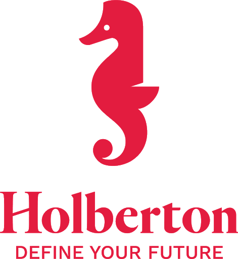

<!-- Portada -->

Hey there, I'm Yesid A. López V.  

 
- I'm constantly learning.
- xxx

- 💻 I’m constantly learning.
- 💬 Ask me about anything, I am happy to help
<h6 align="right"><em> Follow me: </em></h6>

- 📝[Resume](https://drive.google.com/file/d/11ohFer73sUoBm-AIfoG169FrQI_MoJVE/view?usp=sharing)
   

<h3 align="center">Academic background</h3>

Software Developer  
Software Engineer  
Software Developer 

<h3 align="center">My GitHub stats</h3>

<!-- The color is: 56C77B -->

Find me around the web 🌎:
